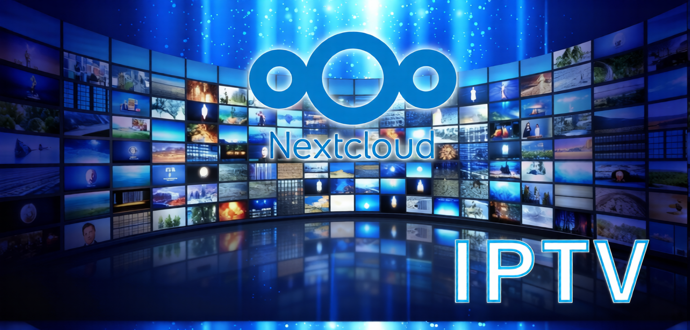
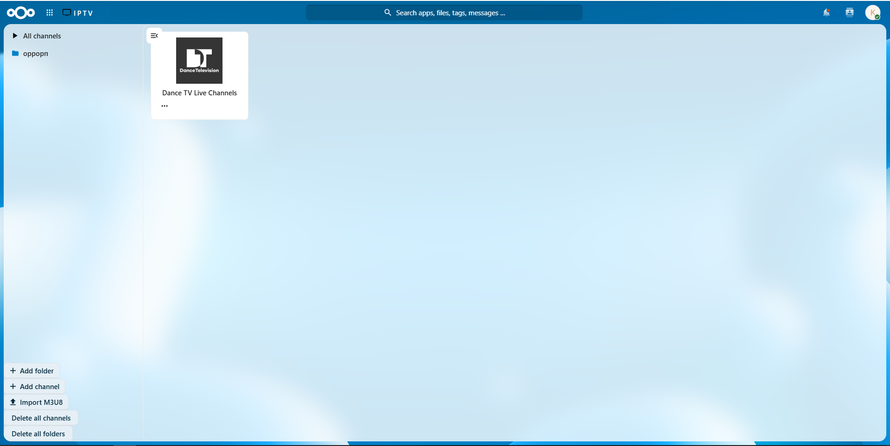
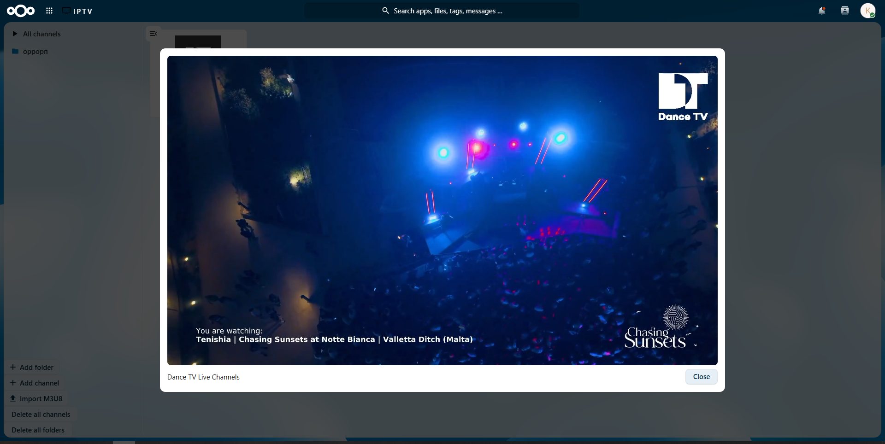

# I P T V

IPTV streaming channels manager for Nextcloud.

Manage and watch IPTV channels directly in Nextcloud. Add channels with streaming URLs, organize them into folders, and watch live TV with HLS video player.

## Features

- Add/Edit/Delete channels with name, stream URL and logo
- Organize channels into folders
- Import/Export M3U playlists
- Built-in HLS video player
- Works with HTTP and HTTPS streams
- Image proxy for HTTP logo URLs (mixed content fix)

## Installation

1. Download and extract the app into `nextcloud/apps/iptv/`
2. Go to Nextcloud Admin → Apps → Tools → enable **I P T V**
3. Open the app from the main menu

## Requirements

- Nextcloud 34+
- PHP 8.1+

## Usage

1. **Add channels** — click "Add channel" button, enter name and stream URL
2. **Organize** — create folders and drag channels into them
3. **Watch** — click a channel card to open the built-in player
4. **Import** — upload M3U files to bulk-add channels
5. **Export** — download channels as M3U playlist

## Default channel

On first launch, a demo channel "Dance TV Live Channels" is pre-configured.
